# Karla

Agentic websearch and scraping system for regional data collection.

```
   ◠ ◠
    ‿
  KARLA
```

## About the Name

Karla is named after the Soviet spymaster in John le Carré's novels - the elusive adversary of George Smiley. Where Smiley painstakingly pieced together fragments of intelligence from multiple sources, Karla operated invisibly behind the Iron Curtain, always present but never seen.

This duality defines our system: a friendly interface (the smiley) backed by a relentless agent that operates where others can't reach - behind geo-blocks, inside JS-rendered walls, speaking local languages. Karla goes where you can't, finds what you need, and brings it back.

## Overview

A platform for collecting structured data from geo-restricted and JS-heavy websites using in-region infrastructure, localised search terms, and intelligent source scoring.

## Key Features

- **In-region scraping**: Deploy Playwright browsers in regional AWS datacenters (e.g., ap-south-1 for India)
- **Localised discovery**: Search in local languages (Hindi, Marathi, Kannada, etc.) to surface data that English queries miss
- **Source scoring**: System learns which sources yield best data per category/region
- **Entity resolution**: Fuzzy matching + LLM to deduplicate records across sources
- **Confidence scoring**: Multi-source verification with quality scores

## Architecture

```mermaid
flowchart TB
    subgraph Orchestrator["🎯 ORCHESTRATOR (Claude)"]
        O1[Parse user intent]
        O2[Generate localized search terms]
        O3[Select sources based on scoring]
        O4[Coordinate regional agents]
        O5[Deduplicate and merge]
    end

    subgraph Agents["🌍 REGIONAL AGENTS"]
        subgraph India["AWS ap-south-1 (India)"]
            I1[Playwright]
            I2[Proxy pool]
        end
        subgraph Europe["AWS eu-west-1 (Europe)"]
            E1[Playwright]
            E2[Proxy pool]
        end
        subgraph Americas["AWS us-east-1 (Americas)"]
            A1[Playwright]
            A2[Proxy pool]
        end
    end

    subgraph Data["💾 DATA LAYER"]
        D1[(Postgres)]
        D2[(Vector DB)]
        D3[(S3)]
        D4[(Metadata store)]
    end

    Orchestrator --> India
    Orchestrator --> Europe
    Orchestrator --> Americas

    India --> Data
    Europe --> Data
    Americas --> Data
```



## Documentation

- [docs/poc/](docs/poc/) - India venues proof of concept
  - `indian_venues_analysis.md` - Technical analysis and architecture
  - `phil_memo_venues_poc.md` - PoC summary and recommendations
  - `salt_proposal.md` - Client proposal
  - `indian_venues_sample.csv` - Sample scraped data (59 venues)
